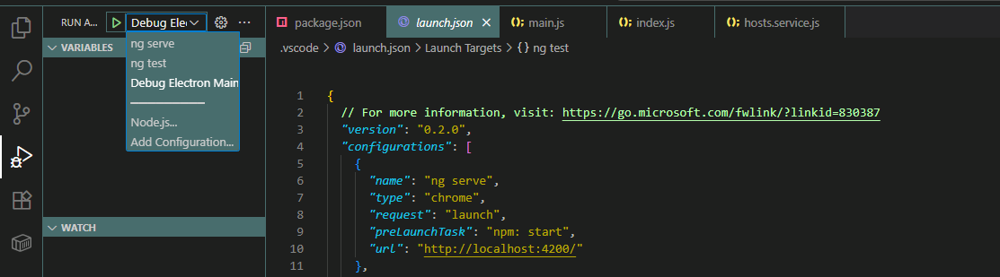
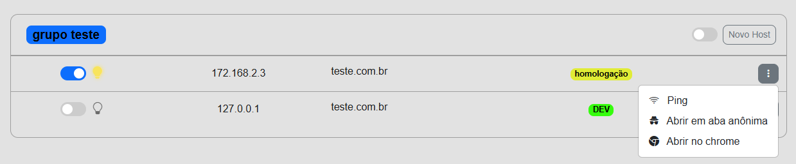
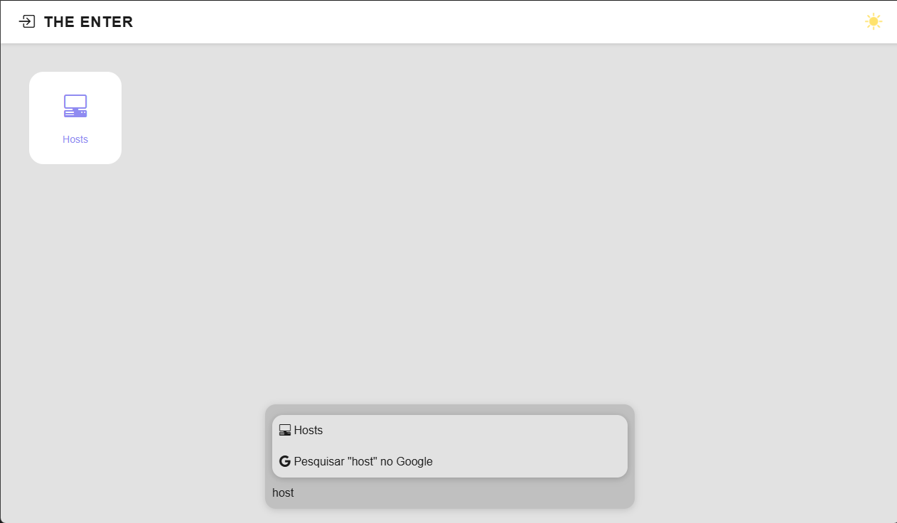
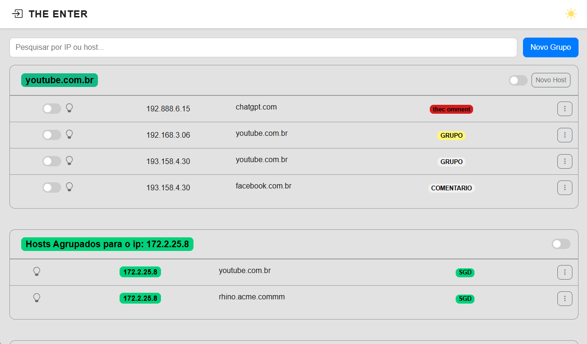
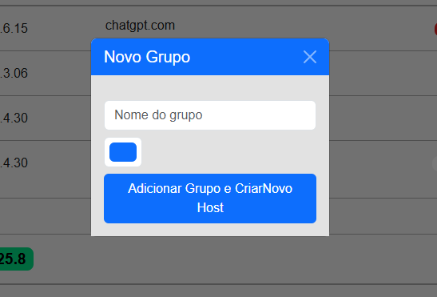
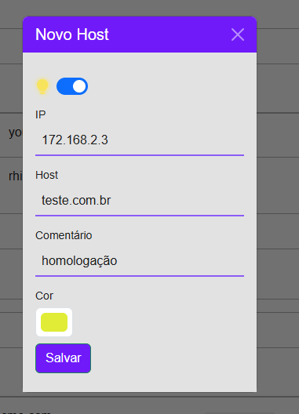
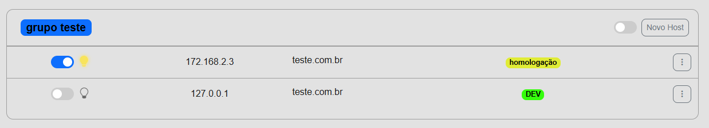

# The Enter
Projeto dedicado a estudos e criação de serviços utilitários para facilitar e elucidar rotinas ou processos.  
A primeira funcionalidade implementada é um **Editor de Hosts do Windows**, que permite visualizar, organizar e editar as entradas do arquivo `hosts` de forma simples e intuitiva.

## Tecnologias
- [Angular](https://angular.io/) (frontend)
- [Electron](https://www.electronjs.org/) (desktop wrapper)

### Instalação do node / electron

 - Após clonar o projeto para seu ambiente local, abra a pasta **enter-project** no seu **vscode**;
 - Baixe o NVM do repositório https://github.com/coreybutler/nvm-windows/releases (arquivo nvm-setup.exe);
 - No próprio terminal do vscode, rode o comando para instalar o node 22:
 
```bash
nvm install 22.17.0

# listar versões do node
nvm list
	
# Usa a versão desejada
nvm use v22
	
```

 - Para instalar o Electron rode:

```bash

npm install electron --save-dev

```

 - Rode também um ```npm i```  para instalar / atualizar todas as dependências;
 - Se não aparecer configurado, ajuste no vsCode para depurar o electron, configure o arquivo lauch.json no debug do vsCode
   
Comandos na **package.json**:
 - Use o comando ```start``` para para inicializar o angular, e se o debug estiver corretamente configurado é só clicar em ```F5``` para inicializar o electron, automaticamente ele vai abrir a janela do app com o angular;
 - O comando ```build:all``` primeiro compila o angular, depois compila o electron para que tudo fique atualizado quando compilar;
	 - O instalador ficara disponível em **...\Enter\enter-project\dist_electron**

Ao inicializar Vai abrir a seguinte janela:


Ao acionar as teclas **ctrl + P**, vai abrir uma aba de pesquisa para encontrar uma funcionalidade ou fazer uma pesquisa no google:


A primeira funcionalidade implementada, é um manipulador de hosts do Windows:


Nela é possível visualizar e editar os hosts, de uma forma mais intuitiva, também é possível agrupar em grupos para melhor organização.
No botão de **Novo Grupo**, é possível cadastrar um grupo e selecionar uma cor:



Ao adicionar o novo grupo, segue para o modal de cadastro do host, é necessário adicionar o ip corretamente e o host que deseja apontar para o novo ip:



 - Sempre será possível adicionar um novo host a um grupo clicando em **Novo Host** no grupo desejado. 
 - Os botões do tipo switch ao lado dos hosts servem para "ligar/desligar" a conexão com o ip configurado, sempre ao ligar algum host, será deligado o host que tiver o mesmo nome, para evitar o conflito, e se quiser manter outro padrão de organização no grupo, é possível ligar e desligar o grupo inteiro


 - Também é possível editar o registro clicando sobre o host;
 - O botão lateral tem algumas funcionalidades uteis também, função de ping para verificar em qual ip está disparando o host, e a opção de abrir o host no navegador;
 

__________________________________________________________________________


